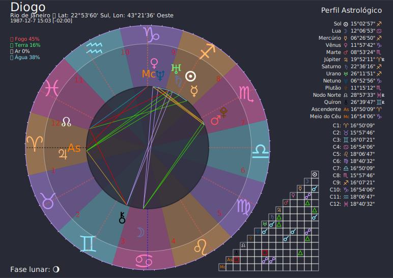

# oraculo-astrology

Mapa Astral como serviço com Python 3.13 e FastAPI.



## Executando

### Docker

Com [Docker](https://www.docker.com) instalado, basta rodar o seguinte comando e uma API HTTP será exposta na porta `8000`

```
docker run -it -p 8000:8000 diogommachado/oraculo-astrology:latest
```

## Documentação

O serviço é exposto utilizando [fastAPI](http://fastapi.tiangolo.com), que expõe uma documentação [OpenAPI](https://fastapi.tiangolo.com/reference/openapi/docs/) 
no caminho `/docs`, ou seja, executando com o comando acima, basta acessar o endereço: [http://localhost:8000/docs](http://localhost:8000/docs)


## Agradecimentos

- https://github.com/aloistr/swisseph
- https://pypi.org/project/kerykeion/
